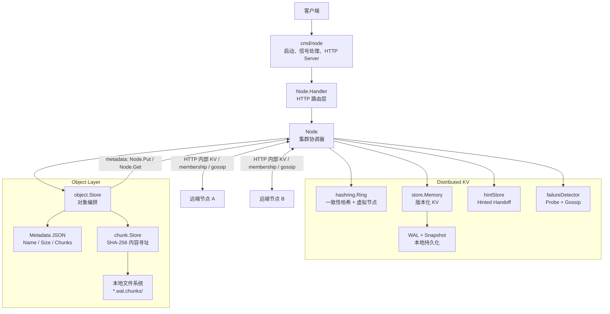
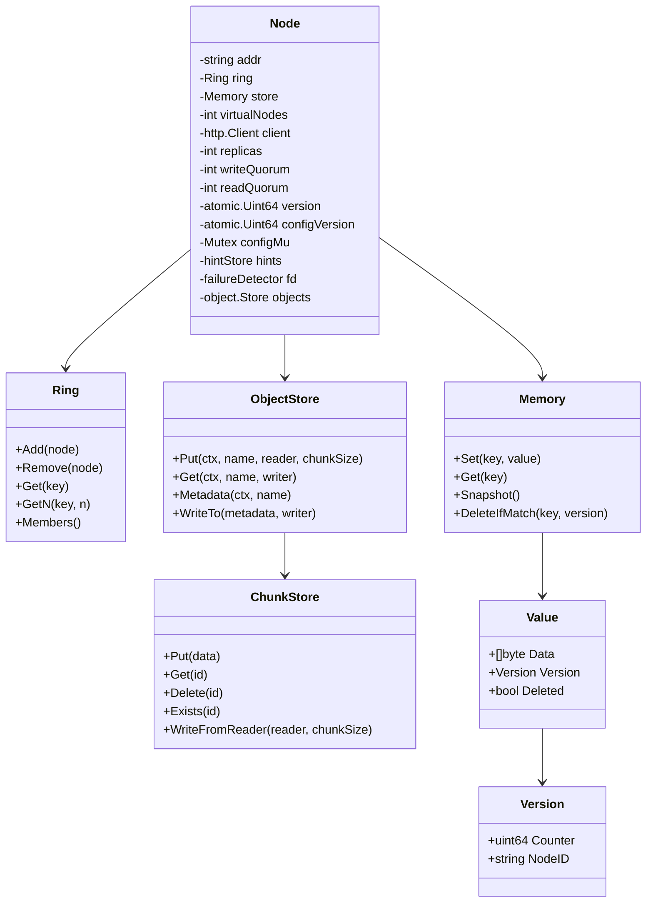
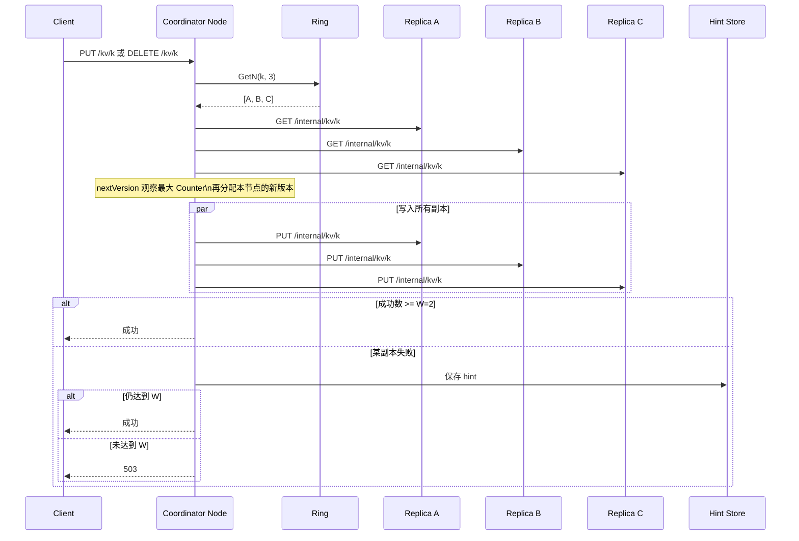
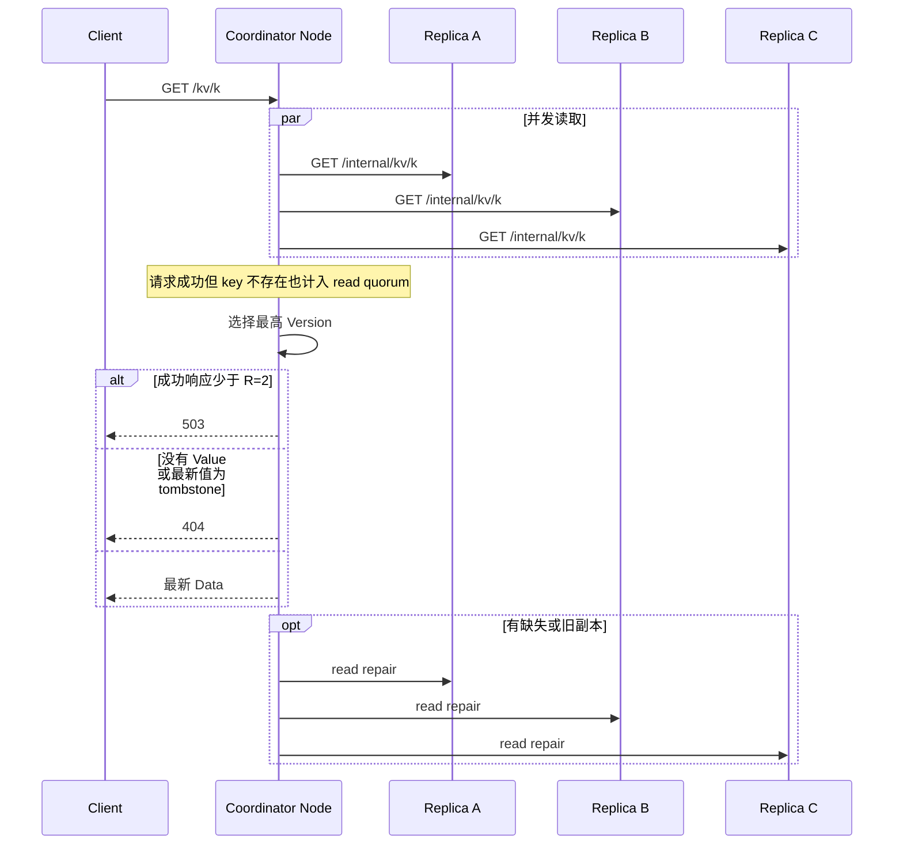
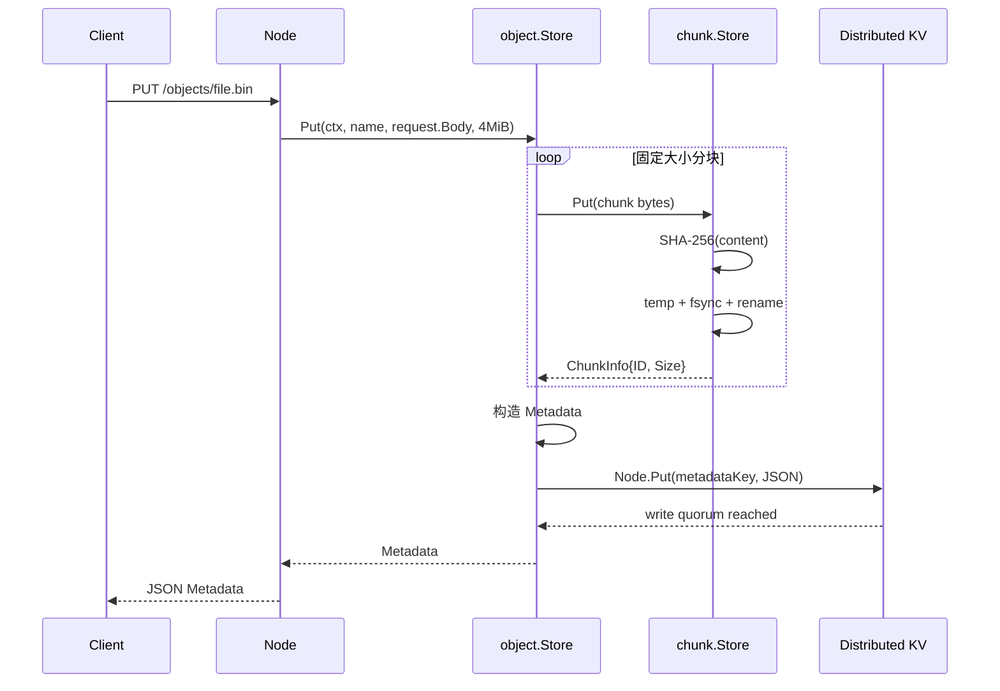
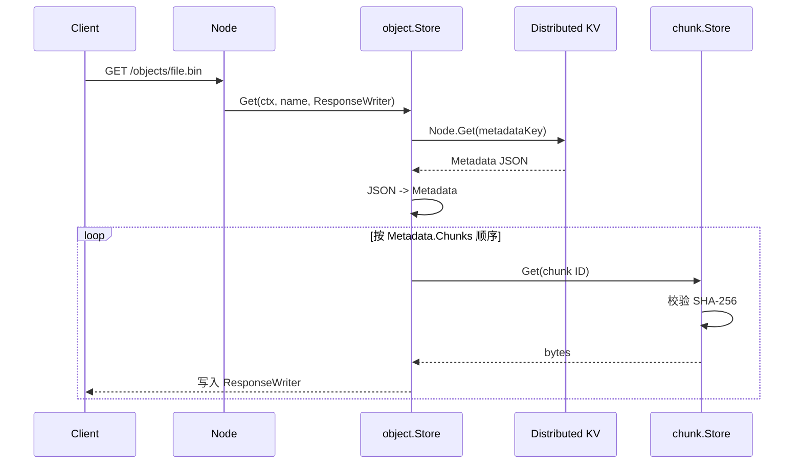
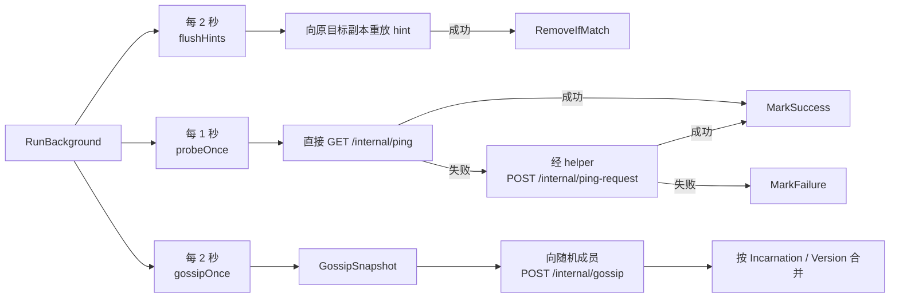
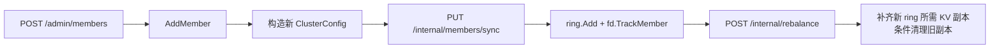
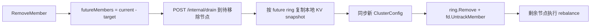

# MiniDist 项目架构

本文描述当前 `main` 分支的实现。MiniDist 目前由两部分组成：一套 Dynamo 风格的分布式 KV，以及建立在其上的对象存储层。KV 使用一致性哈希选择副本，以 `N=3 / W=2 / R=2` 实现 quorum 读写，并提供版本、tombstone、read repair、hinted handoff、故障探测、gossip、成员变更和本地持久化；对象层已经实现固定大小分块、SHA-256 内容寻址和分布式 metadata，但 chunk 数据目前仍只保存在接收上传请求的节点本地。

## 总览



`Node` 是系统的主要协调者。对于 `/kv/` 请求，它根据 ring 选择副本并统计 quorum；对于 `/objects/` 请求，它调用 `object.Store`，将文件切成 chunk，并把对象 metadata 通过现有分布式 KV 保存。

当前对象层的重要边界是：

```text
object metadata  -> distributed KV -> N/W/R、WAL、snapshot
chunk bytes      -> local chunk.Store -> local filesystem
```

因此当前已经有“分布式 metadata + 本地 blob”，但还没有完成 chunk replication。

## 目录与文件职责

```text
minidist/
├── cmd/node/main.go                 # 进程入口、参数、HTTP server、优雅退出
├── internal/hashring/
│   └── ring.go                      # 一致性哈希环、虚拟节点、Get/GetN、成员增删
├── internal/store/
│   ├── memory.go                    # 内存 KV、版本比较、snapshot、条件删除
│   ├── wal.go                       # WAL header、CRC32、回放与尾部修复
│   └── snapshot.go                  # snapshot header、CRC32、原子保存与加载
├── internal/chunk/
│   ├── store.go                     # 本地 content-addressed chunk store
│   └── chunker.go                   # 固定大小流式分块
├── internal/object/
│   ├── metadata.go                  # 对象 manifest / metadata
│   └── store.go                     # object Put/Get、metadata 持久化、chunk 重组
└── internal/node/
    ├── node.go                       # Node 依赖、N/W/R、object store 初始化
    ├── handler.go                    # KV、object、内部和管理 HTTP handler
    ├── replication.go                # quorum 读写、read repair、副本 HTTP 访问
    ├── version.go                    # quorum 读取最大版本并分配新版本
    ├── hint.go                       # hinted handoff 的存储与重放
    ├── membership.go                 # failure detector、状态合并、自我反驳
    ├── probe.go                      # 直接 / 间接 ping
    ├── gossip.go                     # gossip 编码、发送与周期执行
    ├── background.go                 # 后台任务调度
    ├── cluster_membership.go         # 添加/移除成员、配置同步
    ├── drain.go                      # 节点移除前的数据 drain
    ├── rebalance.go                  # 成员变化后的复制与旧副本清理
    └── debug.go                      # 调试接口
```

对应的 `*_test.go` 覆盖 hash ring、KV、WAL/snapshot、chunk store、object store、hint、membership 和部分集群行为。

## Node 的核心状态



- `ring` 决定 KV 副本位置；每个真实节点默认有 100 个虚拟节点。
- `store` 保存 `Value`；DELETE 通过 `Deleted=true` 的 tombstone 表示。
- 版本按 `(Counter, NodeID)` 比较，NodeID 在 Counter 相同时充当确定性 tie-break。
- `Node.Put` / `Node.Get` 是从 HTTP handler 中抽出的分布式 KV API，object metadata 直接复用它们。
- `objects` 组合了分布式 metadata 和本地 chunk store。
- `fd` 维护健康状态、incarnation 和状态版本；failure detector 与正式 cluster membership 是两套不同状态。

## KV 数据路径

### 写入与删除



`Node.Put()` 完成版本分配和 quorum write。DELETE 使用同一复制路径，只是写入 tombstone，因此旧副本或延迟 hint 不能以更低版本把数据复活。

### 读取与 read repair



`Node.Get()` 返回 `([]byte, bool, error)`：`bool=false, error=nil` 表示 key 正常不存在；网络、quorum 等失败通过 `error` 返回。

## 本地持久化

`store.Memory` 使用 WAL 和 snapshot 保存节点本地 KV 状态：

```text
写入 Value
   |
   +-> WAL append + fsync
   |
   +-> 更新内存 map
   |
   +-> WAL 达到阈值 / SaveSnapshot
          |
          +-> 原子保存 snapshot
          +-> fsync
          +-> WAL 截断到 header
```

- WAL 以 `MDWL` header 开头，每条 record 保存长度、CRC32 和 payload。
- snapshot 以 `MDSP` header 开头，保存格式版本、payload 长度和 CRC32。
- 启动时先加载 snapshot，再 replay WAL。
- WAL 最后一个不完整 record 被视为 torn tail，可截断修复；checksum/header 损坏则直接报错。
- snapshot 中同时保存 KV 数据和 `MaxVersionCounter`，恢复后继续分配单调版本。

对象的 chunk 文件不写进 WAL。大块二进制内容直接落在独立 chunk 目录中，WAL 只负责小型 KV / metadata 数据。

## Object Storage

### Metadata

当前 `Metadata` 是对象的 manifest：

```text
Metadata
├── Name
├── Size
├── ChunkSize
└── Chunks[]
    ├── ID   = SHA-256(chunk bytes)
    └── Size
```

metadata key 不直接使用用户文件名，而是：

```text
object name
   -> SHA-256(name)
   -> object:meta:<hash>
```

metadata JSON 最终通过 `Node.Put()` 保存，因此它继承现有 KV 的版本、quorum、replication、WAL 和 snapshot 语义。

### 上传路径



metadata 是对象的逻辑 commit point：所有本地 chunk 先成功写入，最后才提交 metadata。如果 metadata 写失败，可能留下暂时无引用的 orphan chunks，后续可通过 GC 清理。

### 下载路径



`WriteTo()` 同时校验每个 chunk 的实际大小以及最终对象总大小。

### 当前对象层边界

当前 chunk store 是本地的：

```text
PUT /objects/x -> node1
                 |
                 +-> metadata -> distributed KV
                 +-> chunks   -> node1 local filesystem
```

因此 metadata 可以从其他节点读取，但其他节点未必拥有对应 chunk。现阶段要可靠下载对象，应向最初接收上传的节点发送 GET。

下一阶段会把 chunk bytes 自身也分布式化：

```text
chunk bytes
   -> SHA-256 chunk ID
   -> Ring.GetN(chunkID, N)
   -> N 个 chunk owner
   -> chunk write quorum
```

chunk 是 immutable 且 content-addressed，因此未来读取不需要像 KV 那样做版本仲裁：拿到任意一个 SHA-256 校验正确的副本即可返回，再按需要做修复。

## HTTP 接口

| 路径 | 方法 | 用途 |
|---|---:|---|
| `/kv/{key}` | `GET` | quorum read + read repair |
| `/kv/{key}` | `PUT` | 分配新版本并 quorum write |
| `/kv/{key}` | `DELETE` | quorum 写 tombstone |
| `/objects/{name}` | `PUT` | 流式切块、保存本地 chunk、提交分布式 metadata |
| `/objects/{name}` | `GET` | quorum 读取 metadata，并从本地 chunk store 重组对象 |
| `/internal/kv/{key}` | `GET` | 读取单个本地 KV 副本 |
| `/internal/kv/{key}` | `PUT` | 写入单个本地 KV 副本 |
| `/internal/ping` | `GET` | 直接健康探测 |
| `/internal/ping-request` | `POST` | 请求 helper 间接探测节点 |
| `/internal/gossip` | `POST` | 交换 failure detector 状态 |
| `/internal/members/sync` | `PUT` | 同步完整 cluster membership |
| `/internal/drain` | `POST` | 节点移除前向 future ring 迁移 KV |
| `/internal/rebalance` | `POST` | 根据当前 ring 重复制 / 清理 KV |
| `/internal/debug/kv/{key}` | `GET` / `PUT` | 调试本地 KV |
| `/internal/debug/hints` | `GET` | 查看 hints |
| `/internal/debug/members` | `GET` | 查看 ring 与 failure detector 状态 |
| `/admin/members` | `POST` / `DELETE` | 添加 / 移除成员 |

目前没有 `/internal/chunks/` 协议；它属于 chunk replication 阶段，而不是当前已经完成的能力。

## 后台收敛与健康检查



failure detector 状态先比较 `Incarnation`，相同 incarnation 再比较 `Version`。节点收到针对自己的非 alive 更新时，会提高 incarnation 并重新声明 alive（self-refutation）。

failure detector 只回答“节点健康状况如何”，不是正式 cluster membership 的 source of truth。正式成员来自 `hashring.Ring` / cluster config。

## 成员变更与 KV 数据迁移

### 添加成员



### 移除成员



`rebalance` 只有在目标副本复制成功，并且 `DeleteIfMatch` 确认当前本地版本仍等于扫描时版本后，才物理删除旧副本，避免误删并发写入。

当前 drain / rebalance 只处理 KV `store.Memory`，还没有处理 chunk ownership；chunk replication 完成后，成员变化需要单独设计 chunk rebalance / GC。

## 一致性与并发边界

| 主题 | 当前实现 |
|---|---|
| KV 副本选择 | `Ring.GetN` 顺时针收集不重复真实节点。 |
| KV 写入 | `Memory.Set` 拒绝版本不高于当前值的写入。 |
| 版本分配 | quorum 观察最大 Counter，再用本节点 atomic counter 分配新版本。 |
| read repair | 修复本次读取中缺失或版本落后的成功副本。 |
| hint | 按 `(replica,key)` 保存失败副本的最新值，后台重放。 |
| cluster membership | 完整配置 + `configVersion`；与 failure detector 状态分离。 |
| object metadata | 使用分布式 KV，因此具有 KV 的 quorum / version / durability。 |
| chunk ID | `SHA-256(content)`，相同内容得到相同 ID。 |
| chunk 写入 | temp file -> `fsync` -> rename；已存在同 ID 时直接复用。 |
| chunk 校验 | 每次 `Get` 重新计算 SHA-256，检测本地损坏。 |
| chunk replication | 尚未实现，目前只有本地 chunk。 |
| object GC | 尚未实现；metadata 提交失败或对象覆盖后可能留下 orphan chunks。 |
| 进程退出 | `SIGINT` / `SIGTERM` 取消后台任务并在最多 5 秒内关闭 HTTP server。 |

## 后续演进

当前对象存储下一阶段按以下顺序推进：

```text
1. chunk replication
   chunk ID -> consistent hash -> N owners -> write quorum

2. distributed chunk read
   local/remote owner lookup -> first checksum-valid copy -> optional repair

3. chunk rebalance
   cluster membership 变化时迁移 chunk ownership

4. object delete / overwrite semantics
   metadata tombstone / 新 manifest 提交

5. orphan chunk GC
   扫描活跃 metadata -> mark referenced chunk IDs -> sweep unreferenced chunks

6. 更强的 metadata control plane（可选）
   例如 Raft / leader based metadata，而不是继续扩展 Dynamo KV 语义
```

不会把大文件本体塞进现有 KV WAL。KV/WAL 负责小型 metadata，chunk bytes 始终走独立数据路径。

## 典型启动方式

```bash
go run ./cmd/node -addr 127.0.0.1:8081 \
  -cluster 127.0.0.1:8081,127.0.0.1:8082,127.0.0.1:8083
```

默认情况下，一个节点会生成：

```text
minidist-127.0.0.1_8081.wal
minidist-127.0.0.1_8081.wal.snapshot
minidist-127.0.0.1_8081.wal.chunks/
```

同一集群的节点需要从一致的初始成员列表启动。运行期成员变化通过 `/admin/members` 同步 cluster config，并依赖 drain / rebalance 收敛 KV 数据。