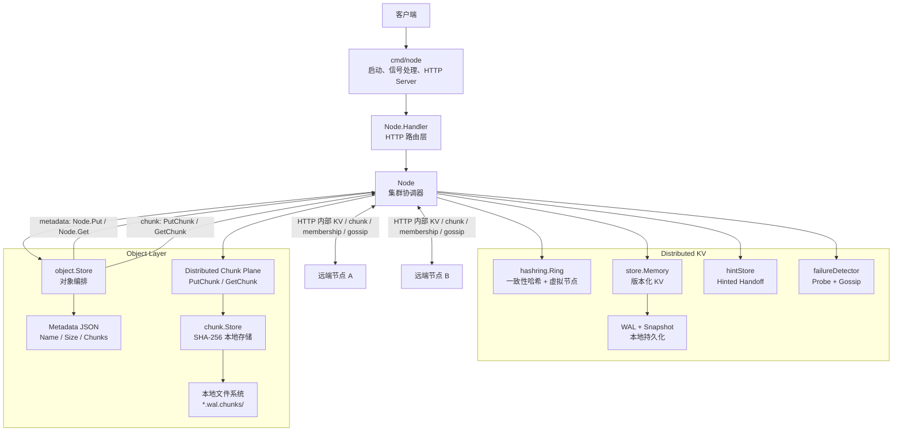
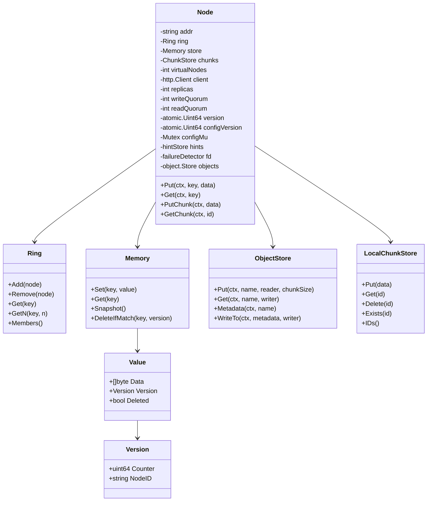
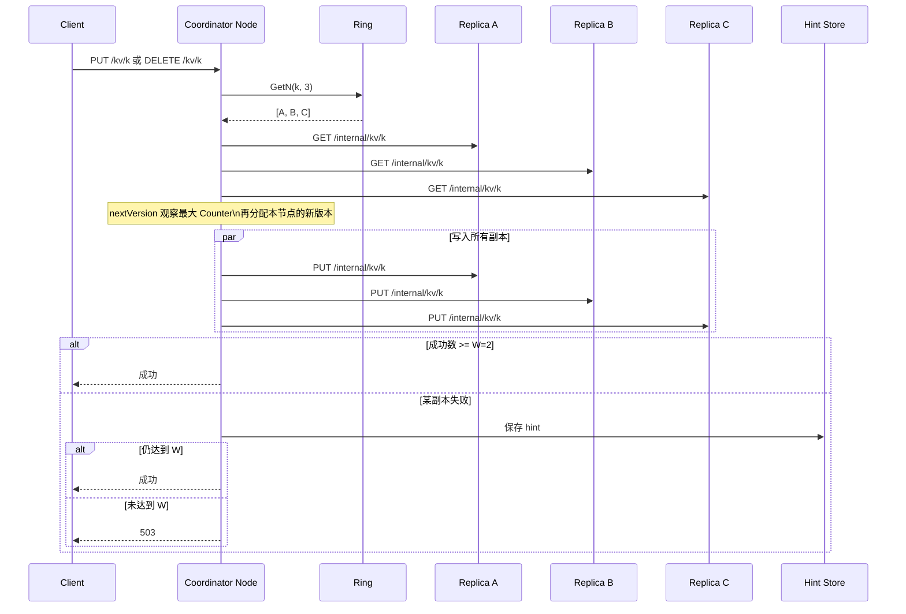
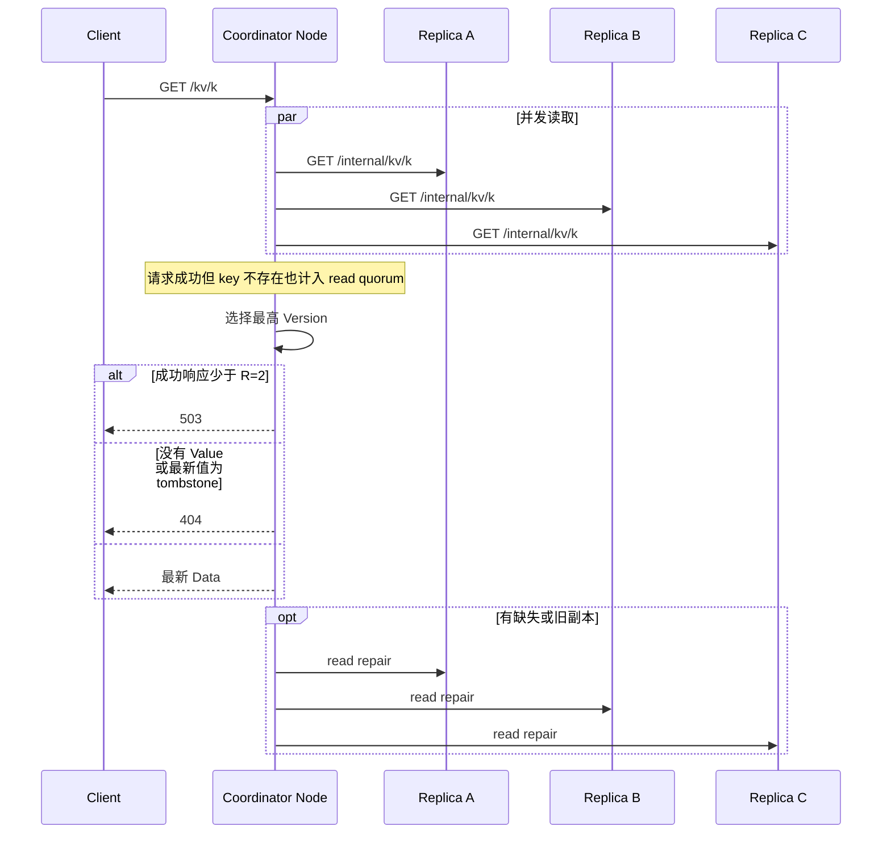
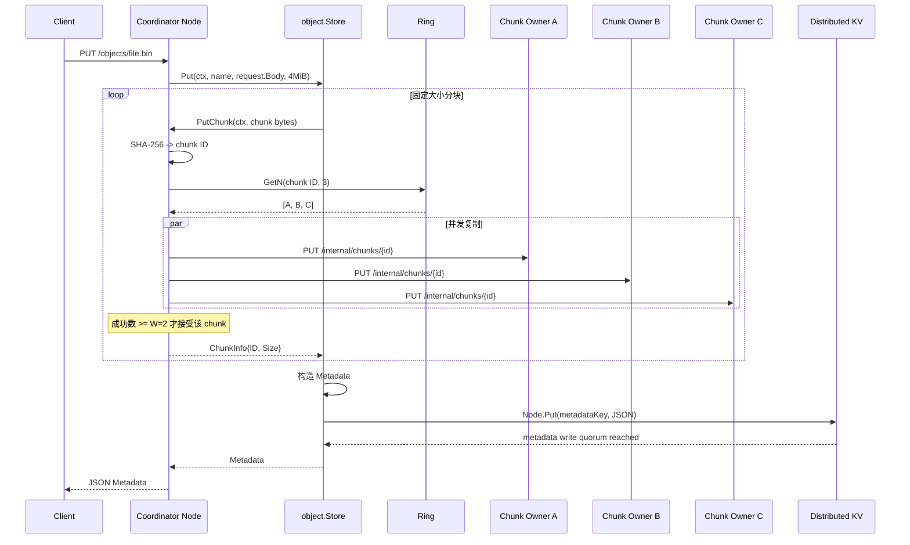
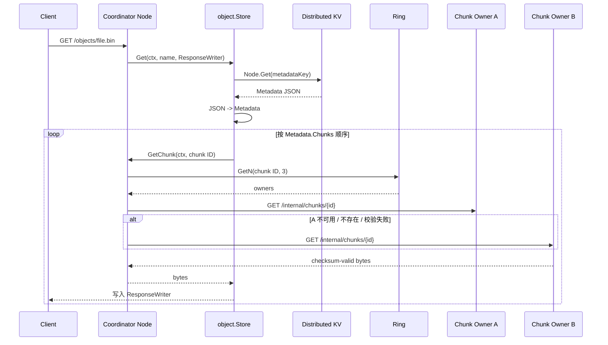
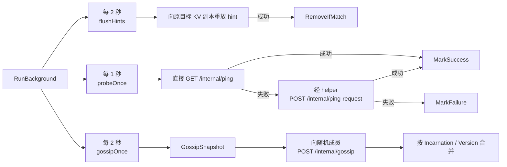
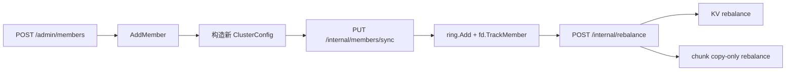
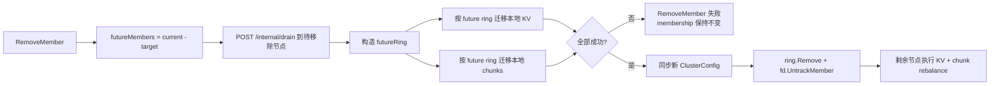

# MiniDist 项目架构

本文描述当前 `main` 分支的实现。MiniDist 目前由两条相互配合的数据路径组成：一套 Dynamo 风格的分布式 KV，以及建立在其上的分布式对象存储。KV 使用一致性哈希选择副本，以 `N=3 / W=2 / R=2` 实现 quorum 读写，并提供版本、tombstone、read repair、hinted handoff、故障探测、gossip、成员变更和本地持久化；对象层将 metadata 保存在现有分布式 KV 中，并把文件内容切成 SHA-256 content-addressed chunks，通过同一条 hash ring 分布到多个节点。

## 总览



`Node` 是系统的主要协调者。对于 `/kv/` 请求，它根据 ring 选择 KV 副本并统计 quorum；对于 `/objects/` 请求，它调用 `object.Store`，由对象层负责切块和 manifest 编排，再分别通过 `Node.Put` / `Node.Get` 访问 metadata，通过 `Node.PutChunk` / `Node.GetChunk` 访问 chunk data plane。

当前对象层的边界是：

```text
object metadata
    -> distributed KV
    -> N/W/R、Version、WAL、Snapshot

chunk bytes
    -> SHA-256 chunk ID
    -> consistent hash
    -> N chunk owners
    -> write quorum / owner fallback
    -> owner local chunk.Store
```

大文件本体不会进入 KV WAL。KV 负责小型、可版本化的 metadata；chunk bytes 使用独立的分布式数据路径和本地文件系统。

## 目录与文件职责

```text
minidist/
├── cmd/node/main.go                  # 进程入口、参数、HTTP server、优雅退出
├── internal/hashring/
│   └── ring.go                       # 一致性哈希环、虚拟节点、Get/GetN、成员增删
├── internal/store/
│   ├── memory.go                     # 内存 KV、版本比较、snapshot、条件删除
│   ├── wal.go                        # WAL header、CRC32、回放与尾部修复
│   └── snapshot.go                   # snapshot header、CRC32、原子保存与加载
├── internal/chunk/
│   ├── store.go                      # 本地 content-addressed chunk store、IDs 枚举
│   └── chunker.go                    # 固定大小分块辅助逻辑
├── internal/object/
│   ├── metadata.go                   # 对象 manifest / metadata
│   └── store.go                      # object Put/Get、metadata 提交、chunk 重组
└── internal/node/
    ├── node.go                        # Node 依赖、N/W/R、chunk/object store 初始化
    ├── handler.go                     # KV、object、内部和管理 HTTP handler
    ├── chunk.go                       # 分布式 chunk Put/Get 和内部 chunk HTTP 协议
    ├── replication.go                 # KV quorum 读写、read repair、副本 HTTP 访问
    ├── version.go                     # quorum 读取最大版本并分配新版本
    ├── hint.go                        # KV hinted handoff 的存储与重放
    ├── membership.go                  # failure detector、状态合并、自我反驳
    ├── probe.go                       # 直接 / 间接 ping
    ├── gossip.go                      # gossip 编码、发送与周期执行
    ├── background.go                  # 后台任务调度
    ├── cluster_membership.go          # 添加/移除成员、配置同步
    ├── drain.go                       # 节点移除前按 future ring 迁移 KV + chunk
    ├── rebalance.go                   # 成员变化后的 KV + chunk rebalance
    └── debug.go                       # 调试接口
```

对应的 `*_test.go` 覆盖 hash ring、KV、WAL/snapshot、chunk store、object store、hint、membership 和部分集群行为。chunk store 还包含并发写同一 content-addressed chunk 的测试。

## Node 的核心状态



- `ring` 同时决定 KV 和 chunk 的副本位置；每个真实节点默认有 100 个虚拟节点。
- `store` 保存版本化 `Value`；DELETE 通过 `Deleted=true` 的 tombstone 表示。
- 版本按 `(Counter, NodeID)` 比较，NodeID 在 Counter 相同时充当确定性 tie-break。
- `chunks` 是当前节点的本地 content-addressed chunk store，真正的跨节点复制由 `Node.PutChunk` / `Node.GetChunk` 负责。
- `object.Store` 不直接依赖具体的本地 chunk store，而依赖 `ChunkStore` 接口；当前 `Node` 同时实现 metadata 和分布式 chunk 两个依赖边界，因此初始化使用 `object.New(n, n)`。
- `fd` 维护健康状态、incarnation 和状态版本；failure detector 与正式 cluster membership 是两套不同状态。

## KV 数据路径

### 写入与删除



`Node.Put()` 完成版本分配和 quorum write。DELETE 使用同一复制路径，只是写入 tombstone，因此旧副本或延迟 hint 不能以更低版本把数据复活。

### 读取与 read repair



`Node.Get()` 返回 `([]byte, bool, error)`：`bool=false, error=nil` 表示 key 正常不存在；网络、quorum 等失败通过 `error` 返回。

## 本地持久化

`store.Memory` 使用 WAL 和 snapshot 保存节点本地 KV 状态：

```text
写入 Value
   |
   +-> WAL append + fsync
   |
   +-> 更新内存 map
   |
   +-> WAL 达到阈值 / SaveSnapshot
          |
          +-> 原子保存 snapshot
          +-> fsync
          +-> WAL 截断到 header
```

- WAL 以 `MDWL` header 开头，每条 record 保存长度、CRC32 和 payload。
- snapshot 以 `MDSP` header 开头，保存格式版本、payload 长度和 CRC32。
- 启动时先加载 snapshot，再 replay WAL。
- WAL 最后一个不完整 record 被视为 torn tail，可截断修复；checksum/header 损坏则直接报错。
- snapshot 中同时保存 KV 数据和 `MaxVersionCounter`，恢复后继续分配单调版本。

对象的 chunk 文件不写进 WAL。大块二进制内容直接落在独立 chunk 目录中，WAL 只负责 KV value 和 object metadata 这类小型数据。

## Object Storage

### Metadata

当前 `Metadata` 是对象的 manifest：

```text
Metadata
├── Name
├── Size
├── ChunkSize
└── Chunks[]
    ├── ID   = SHA-256(chunk bytes)
    └── Size
```

metadata key 不直接使用用户文件名，而是：

```text
object name
   -> SHA-256(name)
   -> object:meta:<hash>
```

metadata JSON 最终通过 `Node.Put()` 保存，因此它继承现有 KV 的版本、quorum、replication、WAL 和 snapshot 语义。

### Chunk 数据模型

chunk 是 immutable、content-addressed 的：

```text
chunk bytes
   -> SHA-256(content)
   -> chunk ID
   -> Ring.GetN(chunk ID, N)
   -> N 个 owner
```

这和 KV 有一个重要区别：

```text
KV
  mutable + versioned
  -> 需要 Version、tombstone、quorum reconciliation、read repair

Chunk
  immutable + content-addressed
  -> ID 已经绑定内容
  -> 不需要版本仲裁
  -> 任意一个 checksum-valid 副本都能作为正确结果
```

每个 owner 最终仍使用 `chunk.Store` 把 chunk 落到自己的本地文件系统。路径按 chunk ID 前缀分层，写入采用独立临时文件、`fsync`、关闭后 rename；并发写入同一 chunk 使用不同临时文件，最终收敛到同一个 content-addressed 目标文件。

### 上传路径



metadata 是对象的逻辑 commit point：只有所有 chunk 都达到 chunk write quorum 后，才提交 metadata。这样不会产生指向“尚未达到最低复制要求”的 manifest。

如果 chunk 已经写入，但后续 chunk 或 metadata 提交失败，磁盘上可能留下暂时无引用的 orphan chunks。当前不在上传路径里做复杂回滚，后续通过 GC 处理。

### 下载路径



`Node.GetChunk()` 按 ring 返回的 owner 顺序尝试副本，取得第一个可用且 SHA-256 校验正确的副本后返回。当前 chunk read 不要求 `R` 个副本，也没有版本仲裁，因为 content-addressed ID 已经定义了正确内容。

`object.Store.WriteTo()` 还会校验每个 chunk 的实际大小以及最终对象总大小。

### Object 与 Chunk 的责任边界

```text
object.Store
│
├── writeChunks()
│   负责：把 Reader 按 chunkSize 切块、维护 ChunkInfo 顺序
│
├── Metadata()
│   负责：manifest 编解码和 metadata key
│
└── ChunkStore interface
    ├── PutChunk(ctx, data)
    └── GetChunk(ctx, id)

Node
│
├── PutChunk / GetChunk
│   负责：ring placement、跨节点 HTTP、副本策略
│
└── chunk.Store
    负责：单节点本地落盘、读取、校验、枚举 IDs
```

因此对象层不关心 chunk 最终在哪个节点；Node 也不负责对象 manifest 的分块顺序和重组语义。

## HTTP 接口

| 路径 | 方法 | 用途 |
|---|---:|---|
| `/kv/{key}` | `GET` | quorum read + read repair |
| `/kv/{key}` | `PUT` | 分配新版本并 quorum write |
| `/kv/{key}` | `DELETE` | quorum 写 tombstone |
| `/objects/{name}` | `PUT` | 固定大小切块、chunk quorum write、最后提交 metadata |
| `/objects/{name}` | `GET` | quorum 读取 metadata，再跨节点读取 chunk 并重组对象 |
| `/internal/kv/{key}` | `GET` | 读取单个本地 KV 副本 |
| `/internal/kv/{key}` | `PUT` | 写入单个本地 KV 副本 |
| `/internal/chunks/{id}` | `PUT` | 校验 chunk ID 后写入本地 chunk store |
| `/internal/chunks/{id}` | `GET` | 从本地 chunk store 返回原始 bytes |
| `/internal/ping` | `GET` | 直接健康探测 |
| `/internal/ping-request` | `POST` | 请求 helper 间接探测节点 |
| `/internal/gossip` | `POST` | 交换 failure detector 状态 |
| `/internal/members/sync` | `PUT` | 同步完整 cluster membership |
| `/internal/drain` | `POST` | 节点移除前按 future ring 迁移 KV + chunk |
| `/internal/rebalance` | `POST` | 根据当前 ring rebalance KV + chunk |
| `/internal/debug/kv/{key}` | `GET` / `PUT` | 调试本地 KV |
| `/internal/debug/hints` | `GET` | 查看 hints |
| `/internal/debug/members` | `GET` | 查看 ring 与 failure detector 状态 |
| `/admin/members` | `POST` / `DELETE` | 添加 / 移除成员 |

内部 chunk `PUT` 会重新计算 SHA-256，拒绝 URL 中 chunk ID 与请求体内容不一致的写入；内部 chunk `GET` 返回 `application/octet-stream`。

## 后台收敛与健康检查



failure detector 状态先比较 `Incarnation`，相同 incarnation 再比较 `Version`。节点收到针对自己的非 alive 更新时，会提高 incarnation 并重新声明 alive（self-refutation）。

failure detector 只回答“节点健康状况如何”，不是正式 cluster membership 的 source of truth。正式成员来自 `hashring.Ring` / cluster config。

当前 hinted handoff 只服务于 KV 写入；chunk data plane 还没有 chunk hint 后台重放机制。

## 成员变更与数据迁移

### 添加成员



新配置先同步到目标节点，所有节点使用新 ring 后再执行 rebalance。

KV rebalance：

```text
local Memory snapshot
   -> current Ring.GetN(key)
   -> 向当前 owners 复制 Value
   -> 失败副本写 hint
   -> 如果本节点已不属于 replica set
      且所有新 owner 都复制成功
      且 DeleteIfMatch 仍匹配扫描版本
      -> 物理删除旧 KV 副本
```

chunk rebalance：

```text
local chunk.Store.IDs()
   -> 读取并校验本地 chunk
   -> current Ring.GetN(chunk ID)
   -> 向当前 owners 复制 chunk
   -> 保留本地旧 chunk
```

chunk rebalance 当前是 **copy-only**。即使当前节点已经不再属于某个 chunk 的 owner set，也不会在 rebalance 路径直接删除旧文件。这样牺牲一些磁盘空间，换取更简单、保守的数据安全边界；旧 chunk 将由后续 GC / cleanup 处理。

### 移除成员

移除节点不能简单地先把它从 ring 删除，因为某些 KV 或 chunk 的必要副本可能仍只存在于待退出节点上。当前实现先进行 future-ring drain：



chunk drain 使用：

```text
待退出节点本地 chunk IDs
   -> chunk.Get(id)
   -> futureRing.GetN(id)
   -> putChunkReplica 到每个 future owner
```

这里不能使用当前 ring，因为当前 ring 仍包含即将退出的节点；drain 的目的正是提前按照“移除完成后的 ring”准备数据。

当前 drain 对 KV 和 chunk 都采用保守策略：任意目标副本复制失败就返回错误，不继续切换 membership。drain 成功后也不会主动删除待退出节点磁盘上的 chunk。

## 一致性与并发边界

| 主题 | 当前实现 |
|---|---|
| KV 副本选择 | `Ring.GetN` 顺时针收集不重复真实节点。 |
| KV 写入 | `Memory.Set` 拒绝版本不高于当前值的写入。 |
| 版本分配 | quorum 观察最大 Counter，再用本节点 atomic counter 分配新版本。 |
| KV read repair | 修复本次读取中缺失或版本落后的成功副本。 |
| KV hint | 按 `(replica,key)` 保存失败副本的最新值，后台重放。 |
| cluster membership | 完整配置 + `configVersion`；与 failure detector 状态分离。 |
| object metadata | 使用分布式 KV，因此具有 KV 的 quorum / version / durability。 |
| chunk ID | `SHA-256(content)`，相同内容得到相同 ID。 |
| chunk placement | `Ring.GetN(chunkID, N)`，与 KV 共用 cluster membership / hash ring。 |
| chunk 写入 | 协调节点并发写 N 个 owner，成功数至少达到 `W`；本地落盘使用独立 temp file -> `fsync` -> rename。 |
| chunk 读取 | 顺序尝试 owner，返回第一个 checksum-valid 副本；不做版本仲裁。 |
| chunk 校验 | 本地 `Get` 和内部协议都以 SHA-256 ID 验证内容。 |
| chunk rebalance | membership 变化后 copy-only 补齐当前 owners，不删除旧 chunk。 |
| chunk drain | RemoveMember 前按 future ring 把待退出节点本地 chunk 复制给未来 owners。 |
| chunk hint / repair | 尚未实现专用 hinted handoff / 后台 read repair；读取只有 owner fallback。 |
| object delete / GC | 尚未实现；上传失败、覆盖或 copy-only rebalance 会留下 orphan / stale chunks。 |
| 进程退出 | `SIGINT` / `SIGTERM` 取消后台任务并在最多 5 秒内关闭 HTTP server。 |

还有几个当前实现故意保留的简单边界：

- `PutChunk` 以 `W` 作为成功条件，但当前实现仍等待本轮所有 owner 请求返回后再判断结果，没有在刚达到 W 时提前返回。
- chunk 没有独立的 hinted handoff，因此某次写入达到 W 但少一个副本时，缺失副本不会像 KV 一样由后台 hint 自动补齐；membership rebalance 或未来的 repair 机制负责后续收敛。
- RemoveMember 的 drain 是当前教学实现的安全门槛，但没有提供完整的强一致 control plane，也没有冻结整个集群的并发客户端写入；后续如果要支持更严格的在线成员变更，需要更强的配置一致性和迁移协议。

## 后续演进

当前对象存储的核心分布式数据路径已经跑通，下一阶段不再是“先把 chunk 分布式化”，而是补齐故障收敛和生命周期管理：

```text
1. chunk repair
   缺失 / 损坏副本 -> 从 checksum-valid owner 恢复目标副本数

2. object delete / overwrite semantics
   metadata tombstone / 新 manifest 提交

3. orphan chunk GC
   扫描活跃 metadata -> mark referenced chunk IDs -> sweep unreferenced chunks
   配合 grace period，避免清理正在上传但尚未提交 metadata 的 chunk

4. stale replica cleanup
   在已经具备安全 GC 语义后，清理由 copy-only rebalance 留下的旧 chunk

5. 更强的 control plane（可选）
   例如 Raft / leader based cluster metadata
   解决并发 membership change、配置顺序和更严格的数据迁移协调
```

不会把大文件本体塞进现有 KV WAL。KV/WAL 继续负责小型、可版本化 metadata；chunk bytes 始终走独立数据路径。

## 典型启动方式

```bash
go run ./cmd/node -addr 127.0.0.1:8081 \
  -cluster 127.0.0.1:8081,127.0.0.1:8082,127.0.0.1:8083
```

默认情况下，一个节点会生成：

```text
minidist-127.0.0.1_8081.wal
minidist-127.0.0.1_8081.wal.snapshot
minidist-127.0.0.1_8081.wal.chunks/
```

同一集群的节点需要从一致的初始成员列表启动。运行期成员变化通过 `/admin/members` 同步 cluster config：扩容后执行 KV + chunk rebalance；缩容先让待退出节点按 future ring drain KV + chunk，再切换 membership，并由剩余节点继续 rebalance。