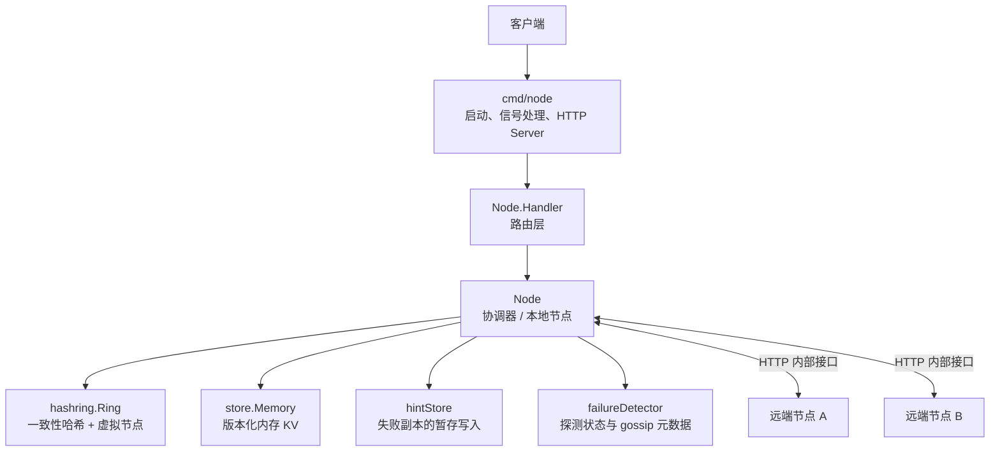
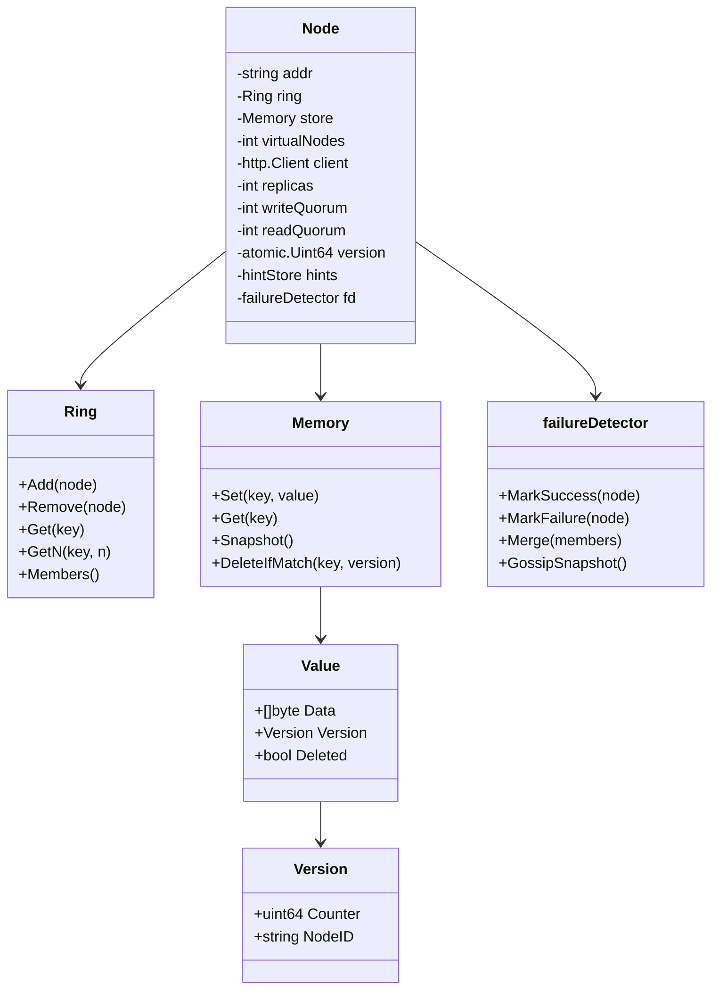
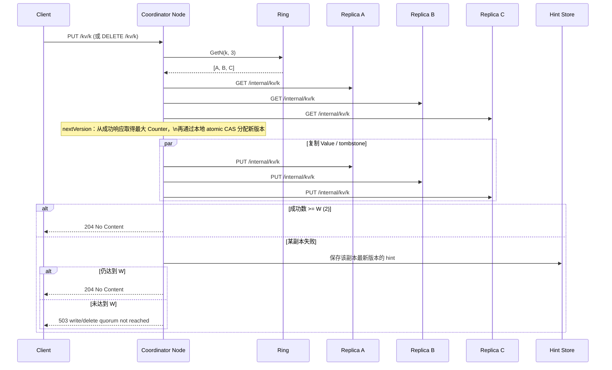
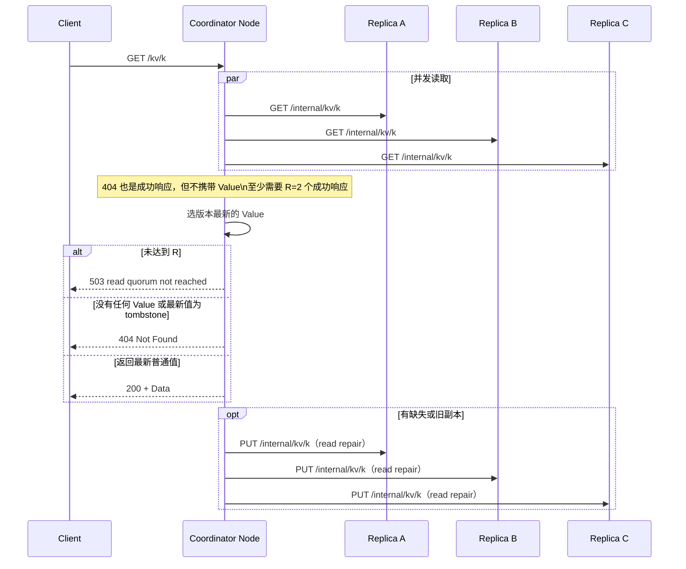
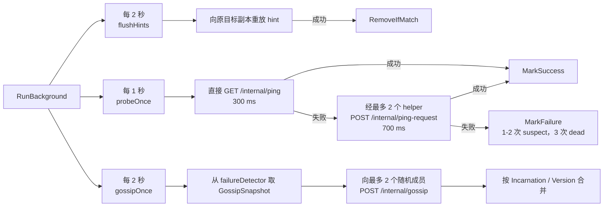

# MiniDist 项目架构

本文描述当前 `main` 分支的实现（`v13`）。MiniDist 是一个基于 HTTP 的内存 KV 集群：使用一致性哈希选择副本，以 `N=3 / W=2 / R=2` 实现 quorum 读写，并提供读修复、hinted handoff、故障探测、gossip 与成员变更期间的数据迁移。

## 总览



`Node` 是主要协调者：收到 `/kv/` 请求后，根据 ring 选出副本，向它们发送内部请求并统计 quorum。每个进程既能做协调器，也能充当其他节点的副本。

## 目录与文件职责

```text
minidist/
├── cmd/node/main.go                 # 进程入口、参数、HTTP server、优雅退出
├── internal/hashring/
│   └── ring.go                       # 一致性哈希环、虚拟节点、Get/GetN、成员增删
├── internal/store/
│   └── memory.go                     # 内存 KV、版本比较、快照、条件删除
└── internal/node/
    ├── node.go                       # Node 依赖与 N/W/R 默认配置
    ├── handler.go                    # HTTP 路由与内部/管理接口 handler
    ├── replication.go                # quorum 读写、读修复、副本 HTTP 访问
    ├── version.go                    # quorum 读取最大版本并分配新版本
    ├── hint.go                       # hinted handoff 的存储与重放
    ├── membership.go                 # failure detector、成员状态合并与自我反驳
    ├── probe.go                      # 直接 / 间接 ping 探测
    ├── gossip.go                     # gossip 编码、发送与周期执行
    ├── background.go                 # 周期任务调度
    ├── cluster_membership.go         # 添加/移除成员的编排、成员同步
    ├── drain.go                      # 移除前的数据 drain
    ├── rebalance.go                  # 成员变化后的复制与旧副本清理
    └── debug.go                      # 调试接口
```

对应的 `*_test.go` 覆盖 hash ring、内存存储、hint、membership 与部分集群成员行为。

## Node 的核心状态



- `ring` 决定数据副本位置；每个真实节点默认有 100 个虚拟节点。
- `store` 保存 `Value`。删除并不立即移除数据，而是写入 `Deleted=true` 的 tombstone。
- 版本按 `(Counter, NodeID)` 比较；Counter 相同时 NodeID 用作确定性 tie-break。
- `fd` 维护存活状态、incarnation 和状态版本，用于探测与 gossip；它与 ring 是两套独立状态。

## HTTP 接口

| 路径 | 方法 | 用途 |
|---|---:|---|
| `/kv/{key}` | `GET` | quorum 读；必要时读修复 |
| `/kv/{key}` | `PUT` | 分配版本后 quorum 写 |
| `/kv/{key}` | `DELETE` | 写入 tombstone 的 quorum 删除 |
| `/internal/kv/{key}` | `GET` | 读取单一副本 |
| `/internal/kv/{key}` | `PUT` | 写入单一副本 |
| `/internal/ping` | `GET` | 直接探测 |
| `/internal/ping-request` | `POST` | 请求辅助节点间接探测 |
| `/internal/gossip` | `POST` | 交换 failure detector 状态 |
| `/internal/members/sync` | `PUT` | 用完整成员列表同步 ring 与探测表新增成员 |
| `/internal/drain` | `POST` | 即将移除的节点向 future ring 复制其数据 |
| `/internal/rebalance` | `POST` | 根据当前 ring 重复制并清理失配旧副本 |
| `/internal/debug/kv/{key}` | `GET` / `PUT` | 直接查看或写入本地存储（调试） |
| `/internal/debug/hints` | `GET` | 查看本地 hints |
| `/internal/debug/members` | `GET` | 查看 ring 成员和 failure detector 状态 |
| `/admin/members` | `POST` | 添加成员 |

说明：当前 `RemoveMember(ctx, member)` 是 Node 方法，尚未注册对应的管理 HTTP 删除接口；`removeMemberAdminRequest` 也尚未被 handler 使用。

## 数据写入与删除



写入与删除共用复制流程。DELETE 发送的是没有 `Data`、但 `Deleted=true` 的 `store.Value`；因此旧副本或延迟 hint 不能以较低版本把已删除数据“复活”。

## 数据读取与读修复



读修复会把最新普通值或 tombstone 写回缺失/落后的成功副本。由于 `Memory.Set` 只接受严格更高版本，这些修复不会覆盖更晚的并发写入。

## 后台收敛与健康检查



failure detector 的状态优先级不是简单的 alive/dead 覆盖：先比较 `Incarnation`，相同 incarnation 再比较 `Version`。节点收到针对自己的更新且该更新声称自己非 alive 时，会提高自己的 incarnation 并重新声明 alive（refutation）。

## 成员变更与数据迁移

### 添加成员


### 移除成员


`rebalance` 只有在所有目标副本复制成功，且本地 `DeleteIfMatch` 的版本仍等于开始扫描时的版本，才清理旧本地副本。这个条件避免了 rebalance 期间刚写入的新值被误删。

## 一致性与并发边界

| 主题 | 当前实现 |
|---|---|
| 副本选择 | `Ring.GetN` 持有读锁，在顺时针方向收集不重复的真实节点。 |
| store 写入 | `Memory.Set` 持有写锁，拒绝版本不高于当前值的写入。 |
| 版本分配 | 先 quorum 读取最大 Counter，再以 `atomic.CompareAndSwap` 分配本节点的下一个 Counter。 |
| read repair | 仅对本次读成功的副本执行；失败副本不在该次读中修复。 |
| hint | 按 `(replica,key)` 只保留最新值；重放成功后以版本匹配方式删除。 |
| 成员同步 | 请求中给出完整成员列表；ring 会删除缺失成员、添加新成员。failure detector 当前只新增追踪成员，不会因同步请求删除历史条目。 |
| 进程退出 | `main` 监听 `SIGINT` / `SIGTERM`，取消后台任务并在最多 5 秒内关闭 HTTP server。 |

## 典型启动方式

```bash
go run ./cmd/node -addr 127.0.0.1:8081 \
  -cluster 127.0.0.1:8081,127.0.0.1:8082,127.0.0.1:8083
```

同一集群的每个节点需要使用同一份初始 `-cluster` 列表；运行时成员变更通过管理接口/Node 成员方法同步，并依赖 drain 与 rebalance 完成数据收敛。
