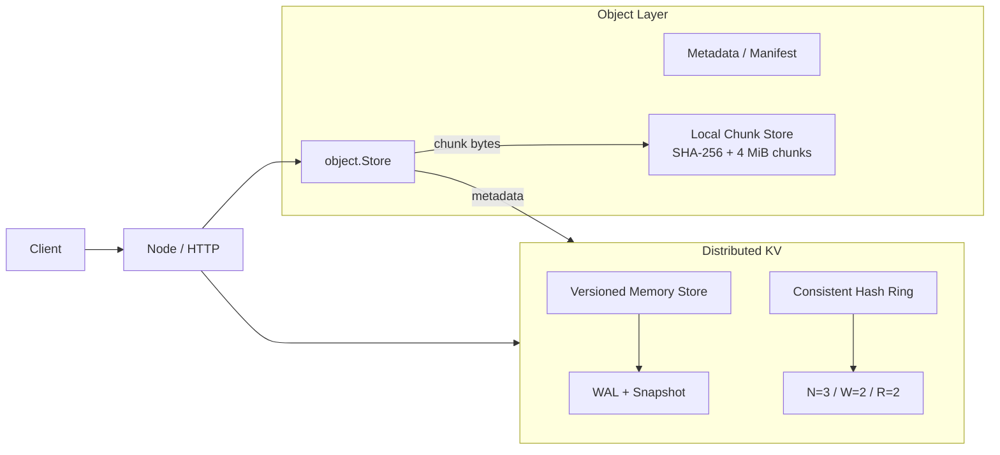

# MiniDist

MiniDist 是一个用 Go 从零实现的分布式系统练习项目。当前已经完成一套 Dynamo 风格的分布式 KV，并在其上开始构建对象存储层：对象 metadata 走现有 quorum KV，文件内容则按固定大小切成 SHA-256 content-addressed chunks 落到本地文件系统。

项目目标不是堆框架，而是自己实现并理解一致性哈希、复制、quorum、版本、故障探测、数据迁移、持久化和对象存储这些核心机制。

完整设计见 [ARCHITECTURE.md](ARCHITECTURE.md)。

## 当前架构



当前对象层的边界很明确：

```text
metadata   -> distributed KV
chunk data -> local filesystem
```

所以目前已经具备分布式 metadata，但 chunk replication 还没有实现。对象上传后，应从最初接收上传的节点读取，直到分布式 chunk 读写完成。

## 已实现功能

- 一致性哈希环与虚拟节点，默认每个真实节点 100 个 virtual nodes
- `N=3 / W=2 / R=2` quorum read / write / delete
- `Node.Put` / `Node.Get` 作为独立的分布式 KV API
- `(Counter, NodeID)` 版本排序和 tombstone
- 并发副本访问与 read repair
- Hinted handoff：失败副本的最新写入暂存并后台重放
- 直接 ping、间接 ping 与 failure detector（alive / suspect / dead）
- Gossip、incarnation 和 self-refutation
- Cluster membership 配置同步
- 节点扩容 rebalance
- 节点移除前 drain 到 future ring，再同步成员并 rebalance
- WAL、CRC32、snapshot、启动恢复和 torn-tail repair
- 固定大小 chunking，默认 4 MiB
- SHA-256 content-addressed chunk store
- chunk 落盘使用临时文件、`fsync`、rename
- chunk 读取时重新校验 SHA-256
- Object metadata / manifest
- Object metadata 通过现有 distributed KV 持久化
- `/objects/{name}` 上传和下载接口

## Object Storage 当前流程

上传：

```text
PUT /objects/file.bin
        |
        v
object.Store.Put
        |
        +-> io.Reader 按 4 MiB 分块
        |      |
        |      +-> SHA-256(chunk)
        |      +-> 本地 *.wal.chunks/ 落盘
        |
        +-> Metadata{Name, Size, ChunkSize, Chunks}
               |
               +-> JSON
               +-> Node.Put
               +-> distributed KV quorum write
```

下载：

```text
GET /objects/file.bin
        |
        v
Node.Get(metadata key)
        |
        v
Metadata
        |
        v
按顺序 chunk.Get(ID)
        |
        +-> SHA-256 校验
        +-> size 校验
        |
        v
HTTP ResponseWriter
```

metadata 在所有 chunk 成功写入后才提交，因此它承担 object 的逻辑 commit point。如果 chunk 已写入但 metadata 提交失败，会留下 orphan chunks；后续会通过 GC 处理，而不是在上传路径里做复杂回滚。

## 快速开始

需要 Go 1.26.2 或更高版本。

打开三个终端，在项目根目录分别启动三个节点：

```bash
go run ./cmd/node -addr 127.0.0.1:8081 \
  -cluster 127.0.0.1:8081,127.0.0.1:8082,127.0.0.1:8083
```

```bash
go run ./cmd/node -addr 127.0.0.1:8082 \
  -cluster 127.0.0.1:8081,127.0.0.1:8082,127.0.0.1:8083
```

```bash
go run ./cmd/node -addr 127.0.0.1:8083 \
  -cluster 127.0.0.1:8081,127.0.0.1:8082,127.0.0.1:8083
```

## KV 使用

写入、读取和删除：

```bash
curl -X PUT --data 'hello' http://127.0.0.1:8081/kv/foo
curl http://127.0.0.1:8082/kv/foo
curl -X DELETE http://127.0.0.1:8083/kv/foo
```

查看成员和健康状态：

```bash
curl http://127.0.0.1:8081/internal/debug/members
```

查看 hints：

```bash
curl http://127.0.0.1:8081/internal/debug/hints
```

## Object 使用

上传一个文件：

```bash
curl -X PUT --data-binary @example.bin \
  http://127.0.0.1:8081/objects/example.bin
```

服务会返回对应的 metadata JSON，其中包含对象总大小和 chunk 列表。

当前 chunk 还是本地存储，因此下载时先访问同一个节点：

```bash
curl http://127.0.0.1:8081/objects/example.bin \
  -o downloaded.bin
```

metadata 本身通过 distributed KV 保存，所以它已经具备 quorum replication 和 WAL/snapshot 持久化；真正缺少的是 chunk bytes 的跨节点复制。

## 成员变更

添加新节点时，先用包含自身的完整初始列表启动：

```bash
go run ./cmd/node -addr 127.0.0.1:8084 \
  -cluster 127.0.0.1:8081,127.0.0.1:8082,127.0.0.1:8083,127.0.0.1:8084
```

然后通过现有节点添加成员：

```bash
curl -X POST http://127.0.0.1:8081/admin/members \
  -H 'Content-Type: application/json' \
  -d '{"member":"127.0.0.1:8084"}'
```

移除节点：

```bash
curl -X DELETE http://127.0.0.1:8081/admin/members \
  -H 'Content-Type: application/json' \
  -d '{"member":"127.0.0.1:8084"}'
```

当前 drain / rebalance 迁移的是 KV 数据，还没有迁移 chunk ownership。chunk replication 完成后会单独补 chunk rebalance。

## 本地数据文件

如果不显式指定 `-wal`，例如 `127.0.0.1:8081` 默认会生成：

```text
minidist-127.0.0.1_8081.wal
minidist-127.0.0.1_8081.wal.snapshot
minidist-127.0.0.1_8081.wal.chunks/
```

其中：

- `.wal` 保存 KV WAL
- `.wal.snapshot` 保存 KV snapshot
- `.wal.chunks/` 保存 content-addressed chunk files

节点启动时先加载 snapshot，再 replay WAL。达到 snapshot 阈值或调用 `SaveSnapshot()` 后会原子保存 snapshot，并把 WAL 截断到只保留 header。

大文件内容不会写进 WAL；WAL 只保存 KV value 和 object metadata 这类小型数据。

## 测试

```bash
go test ./...
go test -race ./...
go vet ./...
```

## 下一步

当前主线是把 chunk data plane 真正分布式化：

```text
1. chunk replication
   SHA-256 ID -> consistent hash -> N owners -> write quorum

2. distributed chunk read
   从 owner 中取得第一个 checksum-valid chunk

3. chunk repair / rebalance
   节点故障或 membership 变化后恢复目标副本数

4. object overwrite / delete
   metadata 更新作为 commit point

5. orphan chunk GC
   mark live metadata -> sweep unreferenced chunks
```

后续如果继续往 control plane 演进，可以再引入更强一致的 metadata 方案，例如 Raft；不会为了“完整”而提前把这些复杂度塞进当前实现。