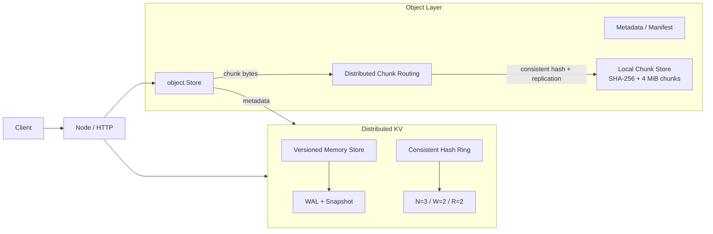

# MiniDist

MiniDist 是一个用 Go 从零实现的分布式系统练习项目。当前已经完成一套 Dynamo 风格的分布式 KV，并在其上构建出可工作的分布式对象存储数据路径：对象 metadata 走现有 quorum KV，文件内容按固定大小切成 SHA-256 content-addressed chunks，再通过一致性哈希复制到多个节点。

项目目标不是堆框架，而是自己实现并理解一致性哈希、复制、quorum、版本、故障探测、数据迁移、持久化和对象存储这些核心机制。

完整设计见 [ARCHITECTURE.md](ARCHITECTURE.md)。

## 当前架构



当前对象层的边界：

```text
metadata   -> distributed KV
chunk data -> distributed chunk data plane -> local filesystem
```

metadata 和 chunk bytes 都已经可以跨节点读写。chunk 本身仍然是不可变的本地文件，但 placement、复制、读取 fallback、membership rebalance 和节点移除前 drain 都由 Node 层负责。

## 已实现功能

- 一致性哈希环与虚拟节点，默认每个真实节点 100 个 virtual nodes
- `N=3 / W=2 / R=2` quorum read / write / delete
- `Node.Put` / `Node.Get` 作为独立的分布式 KV API
- `(Counter, NodeID)` 版本排序和 tombstone
- 并发副本访问与 read repair
- Hinted handoff：失败副本的最新 KV 写入暂存并后台重放
- 直接 ping、间接 ping 与 failure detector（alive / suspect / dead）
- Gossip、incarnation 和 self-refutation
- Cluster membership 配置同步
- 节点扩容 rebalance
- 节点移除前 drain 到 future ring，再同步成员并 rebalance
- WAL、CRC32、snapshot、启动恢复和 torn-tail repair
- 固定大小 chunking，默认 4 MiB
- SHA-256 content-addressed chunk store
- chunk 落盘使用独立临时文件、`fsync`、rename
- 同一 chunk 的并发写入安全
- chunk 读取时重新校验 SHA-256
- chunk 根据一致性哈希选择 N 个 owner
- chunk 写入使用 write quorum
- distributed chunk read：依次尝试 owner，返回第一个 checksum-valid 副本
- membership 变化后的 copy-only chunk rebalance
- RemoveMember 前按 future ring drain chunk
- Object metadata / manifest
- Object metadata 通过现有 distributed KV 持久化
- `/objects/{name}` 跨节点上传和下载接口

## Object Storage 当前流程

上传：

```text
PUT /objects/file.bin
        |
        v
object.Store.Put
        |
        +-> io.Reader 按 4 MiB 分块
        |      |
        |      +-> SHA-256(chunk)
        |      +-> Node.PutChunk
        |              |
        |              +-> consistent hash -> N owners
        |              +-> 并发复制
        |              +-> W quorum 成功
        |
        +-> Metadata{Name, Size, ChunkSize, Chunks}
               |
               +-> JSON
               +-> Node.Put
               +-> distributed KV quorum write
```

metadata 在所有 chunk 成功写入后才提交，因此它承担 object 的逻辑 commit point。如果 chunk 已写入但 metadata 提交失败，会留下 orphan chunks；当前不会在上传路径里做复杂回滚，后续由 GC 处理。

下载：

```text
GET /objects/file.bin
        |
        v
Node.Get(metadata key)
        |
        v
Metadata
        |
        v
按顺序处理每个 chunk ID
        |
        +-> consistent hash -> owners
        +-> 依次尝试副本
        +-> SHA-256 校验
        +-> size 校验
        |
        v
HTTP ResponseWriter
```

chunk 是不可变、按内容寻址的数据，因此当前 distributed read 不做 KV 那样的版本仲裁；只要从负责节点中拿到一个 checksum-valid 副本即可。

## 快速开始

需要 Go 1.26.2 或更高版本。

打开三个终端，在项目根目录分别启动三个节点：

```bash
go run ./cmd/node -addr 127.0.0.1:8081 \
  -cluster 127.0.0.1:8081,127.0.0.1:8082,127.0.0.1:8083
```

```bash
go run ./cmd/node -addr 127.0.0.1:8082 \
  -cluster 127.0.0.1:8081,127.0.0.1:8082,127.0.0.1:8083
```

```bash
go run ./cmd/node -addr 127.0.0.1:8083 \
  -cluster 127.0.0.1:8081,127.0.0.1:8082,127.0.0.1:8083
```

## KV 使用

写入、读取和删除：

```bash
curl -X PUT --data 'hello' http://127.0.0.1:8081/kv/foo
curl http://127.0.0.1:8082/kv/foo
curl -X DELETE http://127.0.0.1:8083/kv/foo
```

查看成员和健康状态：

```bash
curl http://127.0.0.1:8081/internal/debug/members
```

查看 hints：

```bash
curl http://127.0.0.1:8081/internal/debug/hints
```

## Object 使用

上传一个文件：

```bash
curl -X PUT --data-binary @example.bin \
  http://127.0.0.1:8081/objects/example.bin
```

服务会返回对应的 metadata JSON，其中包含对象总大小和 chunk 列表。

对象可以从其他节点读取：

```bash
curl http://127.0.0.1:8082/objects/example.bin \
  -o downloaded.bin
```

校验内容：

```bash
shasum -a 256 example.bin downloaded.bin
```

只要 metadata 和对应 chunk 的可用副本仍存在，读取节点不需要是最初接收上传的节点。

## 成员变更

添加新节点时，先用包含自身的完整初始列表启动：

```bash
go run ./cmd/node -addr 127.0.0.1:8084 \
  -cluster 127.0.0.1:8081,127.0.0.1:8082,127.0.0.1:8083,127.0.0.1:8084
```

然后通过现有节点添加成员：

```bash
curl -X POST http://127.0.0.1:8081/admin/members \
  -H 'Content-Type: application/json' \
  -d '{"member":"127.0.0.1:8084"}'
```

成员配置同步完成后，各节点会执行 rebalance：KV 按当前 ring 迁移；本地 chunk 也会按当前 ring 复制到新的 owner。当前 chunk rebalance 是 copy-only，不会立即删除旧 chunk。

移除节点：

```bash
curl -X DELETE http://127.0.0.1:8081/admin/members \
  -H 'Content-Type: application/json' \
  -d '{"member":"127.0.0.1:8084"}'
```

RemoveMember 使用两阶段流程：

```text
Phase 1
待移除节点根据 future ring drain KV + chunks
        |
        v
全部迁移成功
        |
        v
Phase 2
同步新的 membership
        |
        v
剩余节点 rebalance
```

只要 drain 失败，成员变更就不会继续，因此待移除节点仍保留在当前 ring 中。

## 本地数据文件

如果不显式指定 `-wal`，例如 `127.0.0.1:8081` 默认会生成：

```text
minidist-127.0.0.1_8081.wal
minidist-127.0.0.1_8081.wal.snapshot
minidist-127.0.0.1_8081.wal.chunks/
```

其中：

- `.wal` 保存 KV WAL
- `.wal.snapshot` 保存 KV snapshot
- `.wal.chunks/` 保存本节点持有的 content-addressed chunk files

节点启动时先加载 snapshot，再 replay WAL。达到 snapshot 阈值或调用 `SaveSnapshot()` 后会原子保存 snapshot，并把 WAL 截断到只保留 header。

大文件内容不会写进 WAL；WAL 只保存 KV value 和 object metadata 这类小型数据。

## 测试

基础测试：

```bash
go test ./...
go test -race ./...
go vet ./...
```

对象存储可以做一个跨节点 round trip：

```bash
dd if=/dev/urandom of=/tmp/minidist-test.bin bs=1m count=10

curl -X PUT --data-binary @/tmp/minidist-test.bin \
  http://127.0.0.1:8081/objects/test.bin

curl http://127.0.0.1:8082/objects/test.bin \
  -o /tmp/minidist-downloaded.bin

shasum -a 256 /tmp/minidist-test.bin /tmp/minidist-downloaded.bin
```

还可以使用四节点集群验证 RemoveMember：先上传对象，确认待移除节点实际持有 chunk，再执行 `DELETE /admin/members`，停止该节点，最后从剩余节点下载并比较 SHA-256。这样可以同时覆盖 future-ring chunk drain、membership 更新、rebalance 和 distributed chunk read。

## 当前限制

- chunk rebalance 目前只复制，不主动删除旧副本
- chunk 暂时没有独立的 hinted handoff
- object overwrite / delete 的完整生命周期还没有做完
- orphan / redundant chunks 还没有 GC
- membership 变更仍是教学版协调流程，并没有 Raft / leader 提供强一致控制面
- 当前 rebalance / drain 假设 membership 在操作期间相对稳定

## 下一步

当前比较自然的后续方向：

```text
1. chunk read repair / anti-entropy
   发现缺副本后把 checksum-valid 数据补回目标 owner

2. object overwrite / delete
   metadata 更新作为 commit point，chunk 延迟回收

3. orphan / redundant chunk GC
   mark live metadata -> grace period -> sweep unreferenced chunks

4. chunk rebalance cleanup
   在确认新 owners 安全持有数据后回收旧 placement

5. stronger control plane
   需要时再引入 Raft / leader 来串行化 membership 与 metadata 控制操作
```

MiniDist 目前仍然是教学和练习项目：优先保持协议和数据流清晰，在真实边界出现后再增加复杂机制，而不是提前堆抽象。